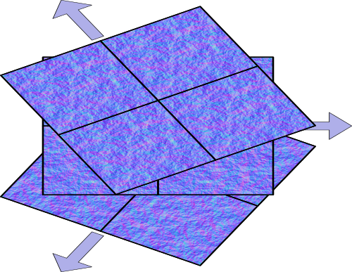
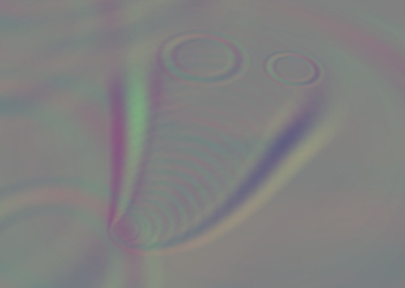

# Cheap Interactive Water Using three.js

The idea is to generate a dynamic normal map in a second scene and use that in the water shader.

The basic water texture is a `MeshStandardMaterial` with a fractal Perlin noise normal map. It is pimped a bit, the normal map is applied three times, each layer rotated by 120°, including flowing direction. The normal map is very small but no repetition is noticable.

In a separate normal scene with the same camera angle, the ripples are drawn using sprites.

They are blended in a way that all normal information of each contributing ripple sprite is just added up. This was a bit tricky because a normal vector component of 0 corresponds to a color component of 0.5, so for each ripple sprite that is drawn, another sprite needs to be drawn that subtracts this 0.5 again. Ripple sprites and minus sprites need to be drawn alternatingly because the blend function clips at 0.0 and 1.0, so we kind of zic zac between those limits. This is why the `renderOrder` has this counting index.

`onBeforeCompile` is used to modify the `MeshStandardMaterial` shader. It adds the normal information of all three normal map layers and the ripple normal scene and renormalizes it.

The result is nothing compared to [this](https://madebyevan.com/webgl-water/), but it is comparatively cheap and simple. It also works in screen space so you can zoom out to your heart's content and create giant oceans.

background image: https://hdri-haven.com/hdri/winter-european-meadow
